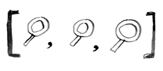
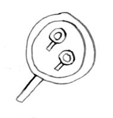
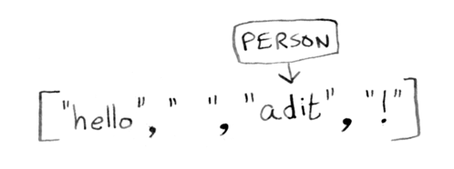
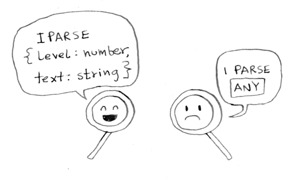

# 5 minute intro

A quick tour of the most important tarsec features.

## 1. Running parsers in sequence



`seq` allows you to run parsers in sequence:

```ts
// define a parser to parse "hello, <name>!"
const parser = seq([
    str("hello"),
    space,

    /*
    `many1WithJoin(noneOf("!"))` parses one or more characters
    that are not an exclamation mark.
    */
    many1WithJoin(noneOf("!")),
    char("!"),
], getResults);

// parse
const parsed = parser("hello adit!");
```

## 2. Composing parsers



Composing parsers is easy.

In the last example, that many1WithJoin line was kind of a mouthful. You you can define a new parser instead:

```ts
const manyTill = (char:string) => many1WithJoin(noneOf(char))
```

And use it:

```ts
// define a parser to parse "hello, <name>!"
const parser = seq([
    str("hello"),
    space,
    manyTill("!"), // much easier to read
    char("!"),
], getResults);
```

## 3. Captures



`seq` will return an array of matches, this can be hard to work with, so you can capture certain matches and assign them a name:

```ts
// define a parser to parse "hello, <name>!"
const parser = seq([
    str("hello"),
    space,
    
    // 1. use capture to assign this match to `person`
    capture(manyTill("!"), "person"),
    char("!"),

    // 2. use `getCaptures` to get the captures
], getCaptures);

// parse
const parsed = parser("hello adit!");

console.log(parsed.success); // true
console.log(parsed.result); // { person: "adit" }
```

## 4. Inferred types



A big benefit of tarsec is it's type inference. Let's look at the type of the parser above.

```ts
/*
    Parser<{ person: string }>
*/
type T = typeof parser;
```

Here's another example. This parser parses markdown-style headers:


```ts
const headingParser = seq([
  capture(count(char("#")), "level"),
  spaces,
  capture(many1WithJoin(noneOf("\n")), "heading"),
], getCaptures);
```

It's type:

```ts
/*
    const headingParser: Parser<{
    level: number;
    heading: string;
}>
*/
```

tarsec has figured out for you what keys will be on the captures object and their types. We can use this to quickly validate an incorrect parser definition.

Define a heading type:

```ts
type Heading = {
  level: number;
  heading: string;
};
```

Then use it:

```ts
const headingParser: Parser<Heading> = seq(
  [
    capture(char("#"), "level"),
    spaces,
    capture(many1WithJoin(noneOf("\n")), "heading"),
    str("\n"),
  ],
  getCaptures
);
```

There is an error in that parser definition. Do you see it? Instead of using `count(char("#"))`, we've used `char("#")`. tarsec will let you know with a type error:

```ts
  Type '{ level: string; heading: string; }' is not assignable to type 'Heading'.
    Types of property 'level' are incompatible.
      Type 'string' is not assignable to type 'number'.ts(2322)
```

That was the five minute intro to tarsec. If you feel ready, you can start writing parsers. Otherwise, read about the [three big concepts](/docs/three-building-blocks.md) in tarsec. After that, you should be ready to write a parser.
