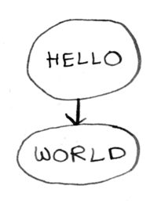

Before we can talk about backtracking, we need to talk about trees. Suppose we are trying to parse the text `"hello world"`. We have a parser like this:

```ts
    const parser = seq([
        str("hello "),
        str("world")
    ], getResults);
```

 This says, first parse the string `"hello "`, then parse the string `"world"`. Every parser can be represented as a tree. Here is a tree for this hello world parser.

 


It's pretty simple: first we parse `hello`, then we parse `world`. Now, suppose we want `"hello world"` to end in either a question mark or an exclamation mark. The parser would look like this

```ts
    const parser = seq([
        str("hello "),
        str("world"),
        or([char("!"), char("?")])
    ], getResults);
```

And the tree would look like this.


After `"world"`, there are two paths we can take: `"hello world!"` or `"hello world?"`. Now, instead of one path through the tree, there are two.

Suppose we try the string `"hello world?"`. Here's the path we would take.

Start with hello, then world, then it's not exclamation mark, but we can try its sibling, question mark.


*In this parser tree, we can go down or sideways*. Here's another way to write the same parser.

```ts
    const parser = seq([
        str("hello "),        
        or([str("world"), str("world!")]),
        optional("?")
    ], getResults);
```

This again parses either `"hello world!"` or `"hello world?"`. Here's the tree:


Now lets try parsing `"hello world!"`. Here's the path we take:


Okay, we're not on the right path. Now what? Well, in this parser we can only go down or sideways, so we have failed. This parser will fail to parse `"hello world!"`, *even though there is a valid path!*

What we really need is the ability to go backward and try another path. This is called **backtracking**.

Here's another example.


This parser will parse `"the robot ate the pie"`, but will fail to parse `"the robot ate the cake"`!

The tarsec parser does some backtracking, so it would be able to parse `"the robot ate the cake"`. But it doesn't backtrack fully, due of performance. *Backtracking can make parsers run much slower.*

Generally, you should try to avoid making your parser backtrack. You can do this by making sure:

1. there is no overlap and
2. the longest option comes first.

In the example above, either of these parsers would have avoided backtracking: