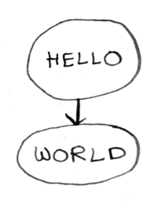
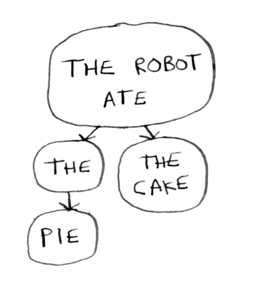
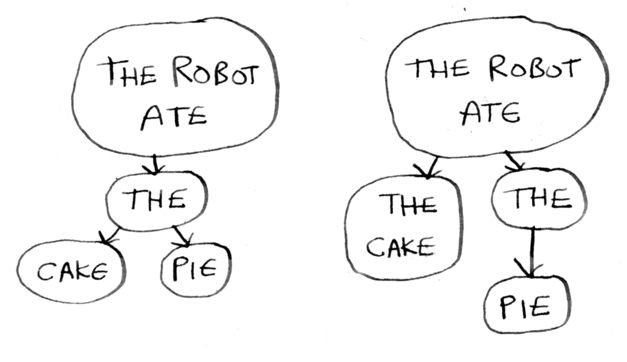

# Disambiguating grammars without backtracking

Tarsec does **not** backtrack. Each parser is tried once, in order — if it succeeds, the input it consumed is gone, and the next parser picks up from there. This keeps parsers fast and predictable, but it means you have to be a little careful when two alternatives share a prefix.

Suppose we are trying to parse `"hello world"`. We have a parser like this:

```ts
    const parser = seq([
        str("hello "),
        str("world")
    ], getResults);
```

This says: first parse `"hello "`, then parse `"world"`. Every parser can be represented as a tree:



Now suppose we want `"hello world"` to end in either a question mark or an exclamation mark:

```ts
    const parser = seq([
        str("hello "),
        str("world"),
        or(char("!"), char("?"))
    ], getResults);
```

The `or` tries each branch in order and returns the first one that succeeds. There's no ambiguity here — `!` and `?` don't share a prefix, so whichever one is in the input matches cleanly.

## The shared-prefix problem

Here's where things get interesting. Consider:

```ts
    const parser = seq([
        str("hello "),
        or(str("world"), str("world!")),
        optional(char("?"))
    ], getResults);
```

Try parsing `"hello world!"`. The `or` tries `str("world")` first — it succeeds and consumes `"world"`. We're now sitting at `"!"`. The `optional(char("?"))` doesn't match, returns `null` without consuming. We never tried `str("world!")`. The parse leaves `"!"` unconsumed.

A backtracking parser would walk back up and try the other branch of the `or`. Tarsec won't. **You need to design the grammar so the first matching branch is the right one.**

There are two ways to fix this:

### 1. Put the longest / most specific alternative first

```ts
    or(str("world!"), str("world"))
```

If `"world!"` is in the input, it wins. If not, `"world"` is tried next. This is the simplest fix and works for most cases.

### 2. Use `peek` as a lookahead guard

When ordering alone isn't enough — for example, when the disambiguating token comes *after* something the branches share — wrap each branch in a `peek` of whatever distinguishes it:

```ts
    or(
      seqR(peek(str("world!")), str("world!")),
      str("world"),
    )
```

`peek(p)` runs `p` against the current input but **does not consume any input** on success. It's positive lookahead. Here it lets the `or` commit to the `"world!"` branch only when the full `"world!"` is actually there; otherwise it falls through to plain `"world"`.

`peek` also has a partner: `not(peek(p))` (or just `not(p)`, since `not` is also non-consuming) is negative lookahead — it succeeds only when `p` would fail. Useful for things like "a digit not followed by another digit":

```ts
    seq([digit, not(peek(digit))], getResults)
```

## A bigger example



This parser will parse `"the robot ate the pie"`, but will fail on `"the robot ate the cake"` — the `or` commits to `str("the")` and then `str(" pie")` can't match `" cake"`.

Two ways to fix it:



Either reorder the `or` (`or(str("the cake"), str("the"))`) so the longer match is tried first, or guard with `peek`:

```ts
    or(
      seqR(peek(str("the cake")), str("the cake")),
      str("the"),
    )
```

## Rules of thumb

1. **No overlap.** If two alternatives never share a prefix, you don't need to think about this.
2. **Longest first.** When alternatives share a prefix, put the longer / more specific one first in the `or`.
3. **Use `peek` when ordering isn't enough.** Particularly when the disambiguating token comes later in the input than the branches' shared prefix.
4. **Use `not` for "unless".** "Match X but not when followed by Y" → `seq([X, not(peek(Y))], ...)`.

See [other tricky cases](/tutorials/backtracking/other-backtracking-issues.md) for more examples of grammars that need care.
